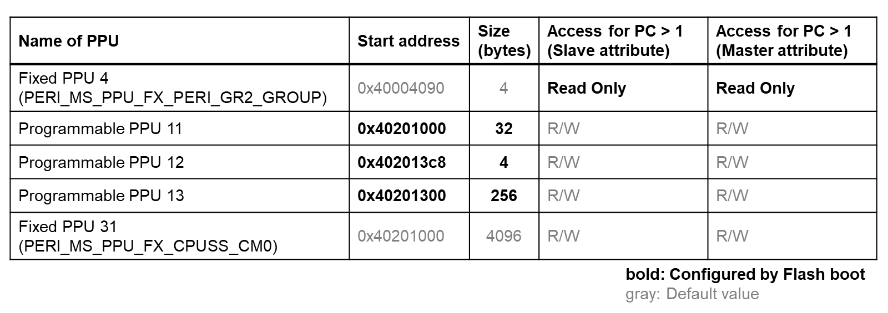
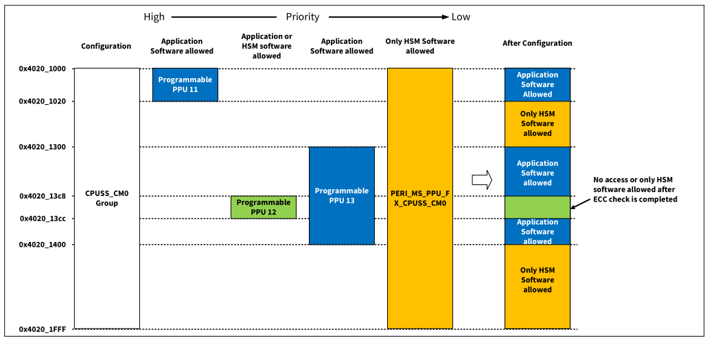
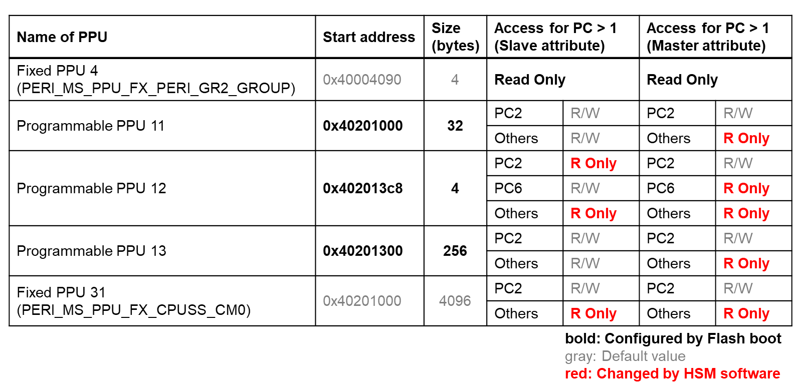
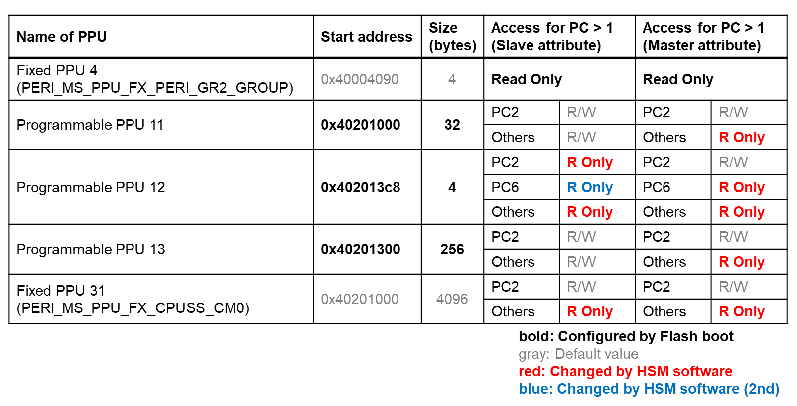
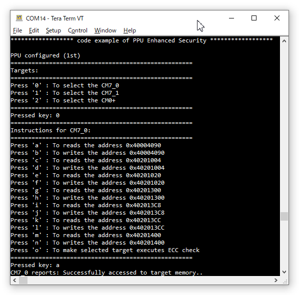

# SECURE PPU Enhanced Security

**This code example shows how to configure a PPU enhanced security.**  

## Device

The device used in this code example (CE) is:

- [TRAVEO™ T2G CYT4BF Series](https://www.infineon.com/cms/en/product/microcontroller/32-bit-traveo-t2g-arm-cortex-microcontroller/32-bit-traveo-t2g-arm-cortex-for-body/traveo-t2g-cyt4bf-series/)

## Board

The board used for testing is:

- TRAVEO™ T2G evaluation kit ([KIT_T2G-B-H_EVK](https://www.infineon.com/cms/en/product/evaluation-boards/kit_t2g-b-h_evk/), [KIT_T2G-B-H_LITE](https://www.infineon.com/cms/en/product/evaluation-boards/kit_t2g-b-h_lite/))

## Scope of work
The PPU (Peripheral Protection Unit) is one of the protection features of the TRAVEO™ T2G MCU. This CE shows how to enhance security by adding a PPU configuration to TOC2 in SFlash and enabling it by flash boot and HSM (Hardware Security Module) software (= CM0+ firmware). This operation can enhance the security of the HSM software. Note that to ensure the security HSM software should be securely booted using secure boot mechanism of the TRAVEO™ T2G MCU, but this CE does not implement that since it focuses to the security enhancement feature. To see how to implement the secure boot mechanism, refer to another CE [SECURE Boot](https://github.com/Infineon/mtb-t2g-example-secure-boot).

## Introduction  

**Protection Unit**  

The PPU controls and monitors unauthorized access from all masters (CPU, P-/M-DMA, Crypto, and the debug interface) to the peripherals. It allows or restricts data transfers on the bus infrastructure. The access rules are enforced based on specific properties of a transfer, such as an address range for the transfer and access attributes (such as read/write, user/privilege, and secure/non-secure). 
There are two types of PPU:
- Fixed PPU structure
  - To protect resources with a known address range. In other words, the ADDR.ADDR and SIZE.REGION_SIZE fields are fixed.
- Programmable PPU structure
  - To protect resources with an unknown address range, full programmability of a protection region's address range definition is used.

More details can be found in [Technical Reference Manual (TRM)](https://www.infineon.com/dgdl/?fileId=5546d4627600a6bc017600bfae720007), [Registers TRM](https://www.infineon.com/dgdl/?fileId=5546d4627600a6bc017600be2aef0004) and [Data Sheet](https://www.infineon.com/dgdl/?fileId=5546d46275b79adb0175dc8387f93228).

## Hardware setup

This CE has been developed for:
- TRAVEO™ T2G evaluation kit ([KIT_T2G-B-H_EVK](https://www.infineon.com/cms/en/product/evaluation-boards/kit_t2g-b-h_evk/)) 
 
No changes are required from the board's default settings.

- TRAVEO™ T2G Body High Lite evaluation kit ([KIT_T2G-B-H_LITE](https://www.infineon.com/cms/en/product/evaluation-boards/kit_t2g-b-h_lite/)) 
 
No changes are required from the board's default settings.

## Implementation

A security marker (TOC2_SECURITY_UPDATES_MARKER) exists in TOC2 of SFlash, to enable security enhancements. When a magic number is set to this marker, the boot process sets the following PPUs to enhance security and safety.

**Security marker setting**  

First, to implement enhanced security, the security marker must be set to a magic number. The markers are defined as *TOC2_SECURITY_UPDATES_MARKER* which is included in a table *SFLASH_TOC2* that are part of the CM0+ firmware.

**PPU settings after enabling the security marker**  
The PPU is already configured as follows by Flash boot at CM0+ firmware startup:  
These protection settings for the region 4096 bytes from address 0x4020_1000 (contains CPUSS_CM0 controls) can be expressed as following memory map image:  
Programmable PPUs have a higher priority than Fixed PPUs. For the same PPU group, the lower number has high priority. Therefore, the actual protection can be shown as in After Configuration figure above. Note that the access rights of each PCs must be properly applied in subsequent steps.

**Protect Context (PC) setting (CM0+)**  

The CM0+ firmware firstly set the PC for each core. In this CE, the PC of CM0+ is set to 2, of CM7_0 is set to 6 and of CM7_1 is set to 7. This operation is done by CM0+ by calling <a href="https://infineon.github.io/mtb-pdl-cat1/pdl_api_reference_manual/html/group__group__prot__functions__busmaster.html#ga4b69f79e24b30f22a706e973b05dd079"><i>Cy_Prot_ConfigBusMaster()</i></a> and <a href="https://infineon.github.io/mtb-pdl-cat1/pdl_api_reference_manual/html/group__group__prot__functions__busmaster.html#ga2d3a54039578a9fae98f6c7b4c4cff41"><i>Cy_Prot_SetActivePC()</i></a> in its initialization phase.

**Setting up the access rights for each PPU regions of PC2-7 (CM0+)**  

Then the CM0+ firmware configures the access attributes of PC2-7 for each PPUs. In this CE, the settings are updated twice before and after the ECC error injection check is performed in CM7_0. The table below shows the setting before the ECC error injection:  
These access attributes are changed by calling <a href="https://infineon.github.io/mtb-pdl-cat1/pdl_api_reference_manual/html/group__group__prot__functions__ppu__prog__v2.html#ga7941e969542970aedcb056f554b5383b"><i>Cy_Prot_ConfigPpuProgSlaveAtt()</i></a> and <a href="https://infineon.github.io/mtb-pdl-cat1/pdl_api_reference_manual/html/group__group__prot__functions__ppu__prog__v2.html#gaa20aec5caa83d665c5a2afe241b6c69e"><i>Cy_Prot_ConfigPpuProgMasterAtt()</i></a> for programmable PPU, <a href="https://infineon.github.io/mtb-pdl-cat1/pdl_api_reference_manual/html/group__group__prot__functions__ppu__fixed__v2.html#ga6112f6eba93e5db763e8dc571a91740a"><i>Cy_Prot_ConfigPpuFixedSlaveAtt()</i></a> and <a href="https://infineon.github.io/mtb-pdl-cat1/pdl_api_reference_manual/html/group__group__prot__functions__ppu__fixed__v2.html#gacc7dadd726bd53886aedfbfa1014ae9e"><i>Cy_Prot_ConfigPpuFixedMasterAtt()</i></a> for fixed PPU with the PC and attributes as arguments.

**Enabling CM7_0/1 (CM0+)**

The CM7_0/1 core will be enabled by calling <a href="https://infineon.github.io/mtb-pdl-cat1/pdl_api_reference_manual/html/group__group__system__config__cm7__functions.html#gacac741f6dd29eb66dc7e4fb31eef52fe"><i>Cy_SysEnableCM7()</i></a> function with their top address where the vector table exists

**ECC Error injection (CM7_0)**

This CE is a scenario where the CM7_0 core performs ECC error injection after startup, but that procedure is not actually implemented; for information on how to implement ECC error injection, see another CE [FAULT REPORT Configuration](https://github.com/Infineon/mtb-t2g-example-fault-report-configuration).

**Setting up again the access rights for programable PPU 12 of PC6 (CM0+)**  

After the ECC error injection is done by CM7_0, CM0+ firmware reconfigures the access attributes of PC6 (= PC bind for CM7_0) for programable PPU 12. Finally, whole PPU settings become like below table:  

**Miscellaneous settings**  

- **STDIO setting (CM0+)**
  - Calling <a href="https://infineon.github.io/retarget-io/html/group__group__board__libs.html#ga21265301bf6e9239845227c2aead9293"><i>cy_retarget_io_init()</i></a> function to use UART as STDIN/STDOUT
    - Initialize the pin specified by CYBSP_DEBUG_UART_TX as UART TX, the pin specified by CYBSP_DEBUG_UART_RX as UART RX (these pins are connected to KitProg3 COM port)
    - The serial port parameters become to 8N1 and 115200 baud
  - The UART receiving interrupt is configured in the <a href="https://infineon.github.io/mtb-hal-cat1/html/group__group__hal__uart.html#ga4dae4cef7dbf1d7935fe6dd6d31f282e"><i>cyhal_uart_enable_event()</i></a> function
  - The interrupt service routine (ISR) is registered by the <a href="https://infineon.github.io/mtb-hal-cat1/html/group__group__hal__uart.html#gae26bab64811713b1d69170352fe32c20"><i>cyhal_uart_register_callback()</i></a> function

**Confirming protection effects**  

- When the CM0+ received the command through the terminal, interrupt occur and the received character can be read by calling <a href="https://infineon.github.io/mtb-hal-cat1/html/group__group__hal__uart.html#ga00ef108f7ee7beba3d5090b2e506b54f"><i>cyhal_uart_read_async()</i></a>, then it reflects to instructions for specified core by *processKeyPress()*
- The instructions and responses are delivered via SRAM which are commonly used between 3 cores
- The core that receives the instruction performs access to specified address and access direction. These will be rejected or granted according to the PPU settings. When the access is rejected, a HardFault exception will be handled by *HardFault_Handler()* function. This CE must be run again from the beginning by entering a reset after an exception occurs.

## Run and Test

For this CE, a terminal emulator is required for displaying outputs and get inputs. Install a terminal emulator if you do not have one. Instructions in this document use [Tera Term](https://ttssh2.osdn.jp/index.html.en).

After code compilation, perform the following steps to flashing the device:

1. Connect the board to your PC using the provided USB cable through the KitProg3 USB connector.
2. Open a terminal program and select the KitProg3 COM port. Set the serial port parameters to 8N1 and 115200 baud.
3. Program the board using one of the following:
    - Select the CE project in the Project Explorer.
    - In the **Quick Panel**, scroll down, and click **[Project Name] Program (KitProg3_MiniProg4)**.
4. After programming, the CE starts automatically. Confirm that the messages are displayed on the UART terminal.

    - *Terminal output on program startup* 

5. You can debug the example to step through the code. In the IDE, use the **[Project Name] Debug (KitProg3_MiniProg4)** configuration in the **Quick Panel**. For details, see the "Program and debug" section in the [Eclipse IDE for ModusToolbox™ software user guide](https://www.infineon.com/dgdl/?fileId=8ac78c8c8386267f0183a8d7043b58ee).

**Note:** **(Only while debugging)** On the CM7 CPU, some code in *main()* may execute before the debugger halts at the beginning of *main()*. This means that some code executes twice: once before the debugger stops execution, and again after the debugger resets the program counter to the beginning of *main()*. See [KBA231071](https://community.infineon.com/t5/Knowledge-Base-Articles/PSoC-6-MCU-Code-in-main-executes-before-the-debugger-halts-at-the-first-line-of/ta-p/253856) to learn about this and for the workaround.

## References  

Relevant Application notes are:

- AN235305 - GETTING STARTED WITH TRAVEO™ T2G FAMILY MCUS IN MODUSTOOLBOX™
- [AN228680](https://www.infineon.com/dgdl/?fileId=8ac78c8c7cdc391c017d0d3e888b67e2) - Secure system configuration in TRAVEO™ T2G family

ModusToolbox™ is available online:
- <https://www.infineon.com/modustoolbox>

Associated TRAVEO™ T2G MCUs can be found on:
- <https://www.infineon.com/cms/en/product/microcontroller/32-bit-traveo-t2g-arm-cortex-microcontroller/>

More code examples can be found on the GIT repository:
- [TRAVEO™ T2G Code examples](https://github.com/orgs/Infineon/repositories?q=mtb-t2g-&type=all&language=&sort=)

For additional trainings, visit our webpage:  
- [TRAVEO™ T2G trainings](https://www.infineon.com/cms/en/product/microcontroller/32-bit-traveo-t2g-arm-cortex-microcontroller/32-bit-traveo-t2g-arm-cortex-for-body/traveo-t2g-cyt4bf-series/#!trainings)

For questions and support, use the TRAVEO™ T2G Forum:  
- <https://community.infineon.com/t5/TRAVEO-T2G/bd-p/TraveoII>  
